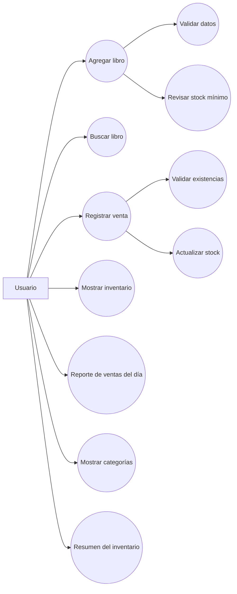
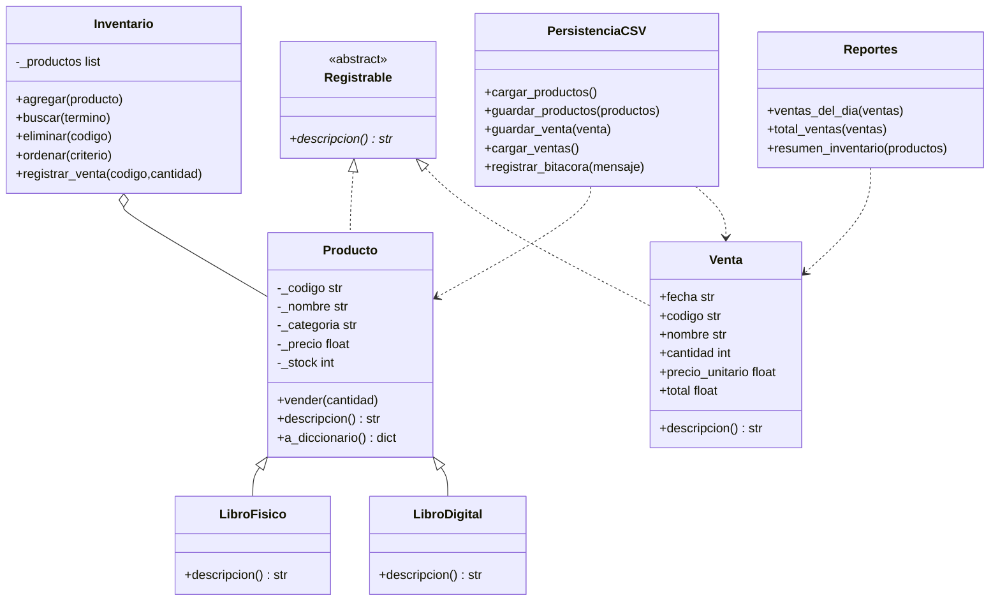

# Diagramas UML

## 1. Casos de uso

```mermaid
flowchart LR
    U[Usuario] --> A((Agregar libro))
    U --> B((Buscar libro))
    U --> C((Registrar venta))
    U --> D((Mostrar inventario))
    U --> E((Reporte de ventas del día))
    U --> F((Mostrar categorías))
    U --> G((Resumen del inventario))
    C --> H((Validar existencias))
    C --> I((Actualizar stock))
    A --> J((Validar datos))
    A --> K((Revisar stock mínimo))
```

## 2. Diagrama de clases

```mermaid
classDiagram
    class Registrable {
        <<abstract>>
        +descripcion()* str
    }
    class Producto {
        -_codigo str
        -_nombre str
        -_categoria str
        -_precio float
        -_stock int
        +vender(cantidad)
        +descripcion() str
        +a_diccionario() dict
    }
    class LibroFisico {
        +descripcion() str
    }
    class LibroDigital {
        +descripcion() str
    }
    class Venta {
        +fecha str
        +codigo str
        +nombre str
        +cantidad int
        +precio_unitario float
        +total float
        +descripcion() str
    }
    class Inventario {
        -_productos list
        +agregar(producto)
        +buscar(termino)
        +eliminar(codigo)
        +ordenar(criterio)
        +registrar_venta(codigo,cantidad)
    }
    class PersistenciaCSV {
        +cargar_productos()
        +guardar_productos(productos)
        +guardar_venta(venta)
        +cargar_ventas()
        +registrar_bitacora(mensaje)
    }
    class Reportes {
        +ventas_del_dia(ventas)
        +total_ventas(ventas)
        +resumen_inventario(productos)
    }
    Registrable <|.. Producto
    Registrable <|.. Venta
    Producto <|-- LibroFisico
    Producto <|-- LibroDigital
    Inventario o-- Producto
    PersistenciaCSV ..> Producto
    PersistenciaCSV ..> Venta
    Reportes ..> Venta
```
